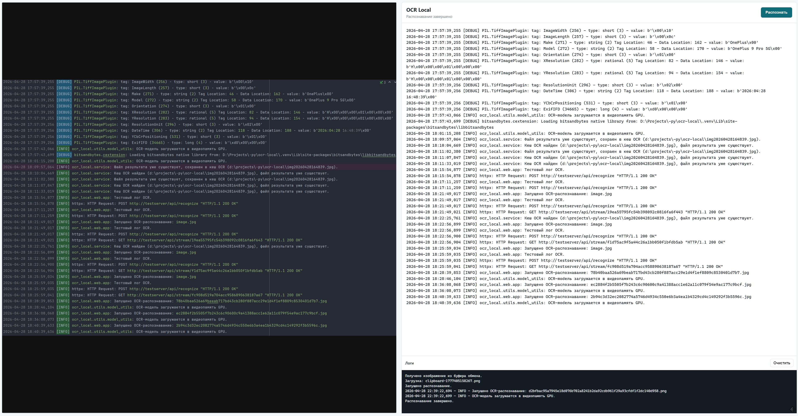
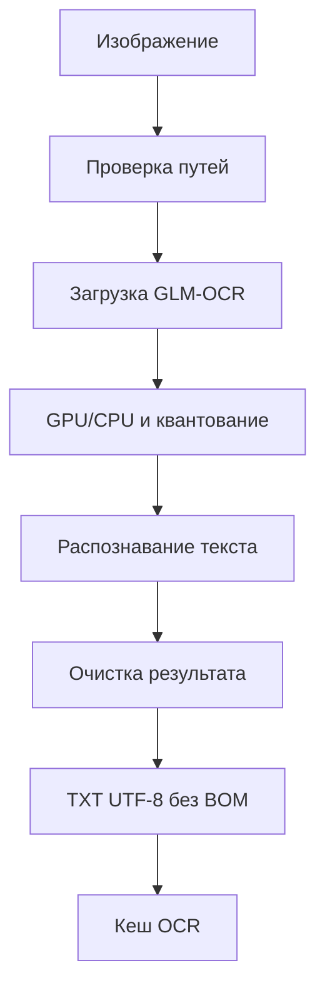

# ocr-local-wrapper

Консольная OCR-утилита на Python для распознавания текста из локальных изображений через
модель `GLM-OCR`.

Базовый сценарий: на вход подается `.jpg`, на выходе создается `.txt` в UTF-8 без BOM.
Модель используется локально из каталога:

```text
.\models\GLM-OCR
```

## Статус проекта

CLI и веб-интерфейс реализованы: пакет `ocr_local` валидирует входное изображение,
загружает локальную `GLM-OCR`, выполняет инференс, пишет `.txt` в UTF-8 без BOM и
показывает результат в браузере.

## Структура проекта

```text
.
├─ ocr_local
│  ├─ __main__.py                  # запуск python -m ocr_local
│  ├─ cli.py                       # CLI и разбор аргументов
│  ├─ constants.py                 # константы проекта
│  ├─ exceptions.py                # исключения OCR-пайплайна
│  ├─ service.py                   # пайплайн OCR
│  ├─ models.py                    # настройки запуска
│  ├─ web
│  │  ├─ app.py                    # FastAPI веб-интерфейс
│  │  ├─ __main__.py               # запуск python -m ocr_local.web
│  │  └─ static                    # HTML/CSS/JS
│  └─ utils
│     ├─ env_utils.py              # загрузка .env
│     ├─ io_utils.py               # пути, кодировки, запись результата
│     ├─ logging_utils.py          # логирование
│     └─ model_utils.py            # GPU, квантование, загрузка модели
├─ logs                            # логи
├─ resources
│  └─ cache                         # кеш готовых OCR-результатов
├─ tests                           # тесты
├─ run_web.ps1                     # запуск веб-интерфейса
├─ .env                            # локальные переменные окружения
├─ pyproject.toml                  # метаданные пакета и pytest
├─ requirements.txt                # зависимости
├─ README.md                       # инструкция
└─ PRD.md                          # требования
```

## Ключевые возможности

- Распознавание текста из локального изображения.
- Использование локальной модели `GLM-OCR` без внешних API.
- Автоматический выбор GPU при доступной CUDA.
- 8-битная квантовка через `bitsandbytes` при доступной CUDA.
- Кеш готовых OCR-результатов по пути входного файла.
- Веб-интерфейс с preview изображения, textarea результата и логами.
- Запись результата в `.txt` в UTF-8 без BOM.
- Явный путь вывода или автоматическое имя `<image-stem>.txt`.

## Пример работы



## Консольный запуск

Минимальный запуск:

```bash
python -m ocr_local --input IMG.jpg
```

С явным путем вывода:

```bash
python -m ocr_local --input IMG.jpg --output result.txt
```

Полный вызов с основными флагами:

```bash
python -m ocr_local \
  --input IMG.jpg \
  --output IMG.txt \
  --model-path D:\Projects\-ai\+image-to-text\GLM-OCR \
  --prompt "Text Recognition:" \
  --max-new-tokens 8192 \
  --allow-cpu-fallback \
  --force \
  --verbose
```

Ключевые флаги:

- `--input` - путь к входному изображению.
- `--output` - путь к выходному `.txt`; по умолчанию файл рядом с изображением.
- `--model-path` - путь к локальной модели.
- `--prompt` - промпт для OCR; по умолчанию `Text Recognition:`.
- `--max-new-tokens` - лимит генерации; по умолчанию `8192`.
- `--no-quantization` - загрузить модель без 8-битной квантовки.
- `--allow-cpu-fallback` - попробовать CPU, если загрузка на GPU не удалась.
- `--force` - игнорировать кеш OCR и перезаписать существующий `.txt`.
- `--verbose` - подробный вывод.

## Модель GLM-OCR

Локальный каталог модели должен содержать:

```text
config.json
generation_config.json
model.safetensors
preprocessor_config.json
tokenizer.json
tokenizer_config.json
chat_template.jinja
```

Прямой инференс выполняется через `transformers`:

- `AutoProcessor.from_pretrained(model_path)`
- `AutoModelForImageTextToText.from_pretrained(model_path, ...)`
- `processor.apply_chat_template(...)`
- `model.generate(...)`
- `processor.decode(...)`

Базовый OCR-промпт:

```text
Text Recognition:
```

## Веб-интерфейс

Запуск:

```powershell
.\run_web.ps1
```

Откройте http://127.0.0.1:7861.

Если сервис уже запущен на этом порту, скрипт выведет текущий URL и завершится без ошибки.

Переопределение адреса и порта:

```powershell
.\run_web.ps1 -HostAddress 0.0.0.0 -Port 7862
```

Экран разделен на две части:

- слева - загруженное изображение или drop zone для перетаскивания/выбора файла;
- справа - textarea с распознанным текстом, кнопка `Распознать` и консоль логов.

Поведение:

- при загрузке изображения backend сохраняет файл в `resources/uploads` по SHA-256;
- изображение можно выбрать, перетащить или вставить из буфера обмена через `Ctrl+V`;
- если для изображения уже есть валидный кеш OCR, текст сразу подставляется в textarea;
- кнопка `Распознать` запускает OCR через тот же сервис, что и CLI;
- строки логов OCR транслируются в UI через SSE и отображаются в блоке `Логи`.

API:

- `GET /api/health` -> `{ "status": "ok" }`
- `POST /api/upload` -> multipart `file`, ответ: `image_path`, `image_url`, `output_path`, `cached`, `text`
- `GET /api/image/{name}` -> загруженное изображение
- `POST /api/recognize` -> JSON `{ "image_path": "...", "force": false }`, ответ: `{ "job_id": "..." }`
- `GET /api/stream/{job_id}` -> SSE (`text/event-stream`), события:
  - `{"type":"log","message":"..."}`
  - `{"type":"done","status":"ok","result":{...}}`
  - `{"type":"done","status":"error","error":"..."}`

## GPU и квантование

Ожидаемая логика загрузки:

1. Если `torch.cuda.is_available()` возвращает `True`, используется CUDA.
2. Если CUDA доступна и установлен `bitsandbytes`, включается 8-битная квантовка.
3. Модель загружается с `device_map="auto"`.
4. Для квантования используется `BitsAndBytesConfig(load_in_8bit=True)`.
5. Флаг `--no-quantization` отключает только квантование, но не CUDA.
6. Флаг `--allow-cpu-fallback` разрешает повторную загрузку на CPU при ошибке GPU.

## Форматы и кодировки

Вход:

- `.jpg`
- `.jpeg`
- `.png`
- `.webp`
- `.bmp`

Выход:

- `.txt`
- UTF-8 без BOM
- только распознанный текст без служебных токенов модели

## Кеши и логи

Кеш OCR:

- `resources/cache/ocr_output_cache.json` - готовые OCR-результаты.
- Ключ кеша строится по абсолютному пути входного изображения.
- Запись кеша содержит размер и `mtime` входного файла; если изображение изменилось,
  кеш не используется.
- Если кеш найден и `--force` не задан, модель не загружается, результат сразу пишется
  в указанный `.txt` или считается готовым, если файл результата уже существует.
- Если кеша нет, но `.txt` уже существует, файл результата сохраняется в кеш и модель
  не загружается.
- `--force` пропускает кеш, запускает модель заново и обновляет запись кеша.

Логи:

- `logs/ocr_local.log` - основной лог CLI и веб-запусков OCR.

## Требования и установка

Целевая версия Python:

```text
Python 3.14
```

Зависимости первой версии:

`requirements.txt` содержит полный lock-набор с транзитивными зависимостями. Локальный
`GLM-OCR` указывает `transformers_version: 5.0.1dev0`; на практике проверена стабильная
связка `transformers==5.6.2`, где уже есть `Glm46VProcessor`.

Установка:

```powershell
py -3.14 -m venv .venv
.\.venv\Scripts\python.exe -m pip install -r requirements.txt
```

Проверка CUDA-стека:

```powershell
.\.venv\Scripts\python.exe -B -c "import torch, transformers; print(torch.__version__, torch.version.cuda, torch.cuda.is_available(), transformers.__version__)"
```

## Переменные окружения

Переменные в `.env`:

- `OCR_MODEL_PATH` - путь к модели по умолчанию.
- `HF_HOME` - базовый каталог кеша HuggingFace.
- `HUGGINGFACE_HUB_CACHE` - кеш HuggingFace Hub.
- `TEMP`/`TMP` - каталог временных файлов.
- `HF_HUB_DISABLE_SYMLINKS_WARNING=1` - отключение предупреждения о symlink на Windows.

Пример:

```env
OCR_MODEL_PATH=D:\Projects\-ai-models\+image-to-text\GLM-OCR
HF_HOME=D:\Projects\ocr-local\models\hf
HUGGINGFACE_HUB_CACHE=D:\Projects\ocr-local\models\hf\hub
TEMP=D:\Temp
TMP=D:\Temp
HF_HUB_DISABLE_SYMLINKS_WARNING=1
```

## Пайплайн OCR

1. Проверка входного изображения и пути вывода.
2. Загрузка процессора `GLM-OCR`.
3. Выбор устройства и конфигурации квантования.
4. Загрузка модели.
5. Подготовка сообщения с изображением и промптом.
6. Генерация результата.
7. Очистка служебных токенов.
8. Запись `.txt` в UTF-8 без BOM.
9. Обновление кеша OCR.

## Диаграмма



## Тесты

Unit-тесты:

```powershell
.\.venv\Scripts\python.exe -B -m pytest
```

Отдельный модуль `tests/test_ocr_text_image.py` генерирует тестовую картинку с текстом
`ПОРОШОК / НЕ ВХОДИ` и прогоняет ее через OCR-пайплайн с мокнутой моделью.
Модуль `tests/test_output_cache.py` проверяет восстановление из кеша без загрузки модели,
сохранение существующего `.txt` в кеш, обновление кеша после OCR и пропуск кеша через
`--force`.
Модуль `tests/test_web_app.py` проверяет загрузку веб-страницы, upload/cache API и
распознавание с SSE-логами через мокнутый OCR-сервис.

Тяжелый тест с реальной локальной моделью выключен по умолчанию:

```bash
$env:RUN_GLM_OCR_TEST = "1"
.\.venv\Scripts\python.exe -B -m pytest -m integration
```

Минимальный ручной прогон:

```powershell
.\.venv\Scripts\python.exe -B -m ocr_local --input IMG.jpg --allow-cpu-fallback --force
```

Ожидаемый результат: файл `IMG.txt` рядом с изображением.

## Дневник изменений

Пока отдельный `CHANGELOG.md` не ведется.
